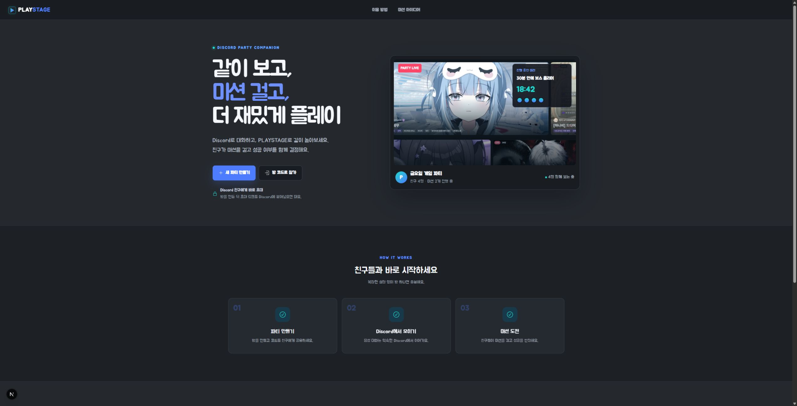
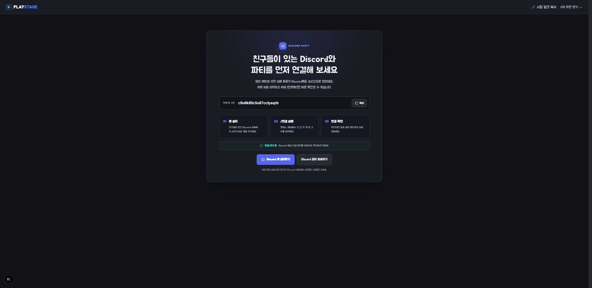
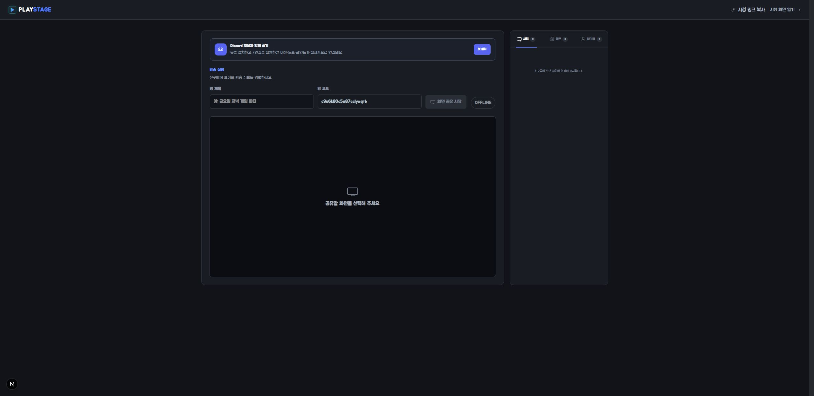
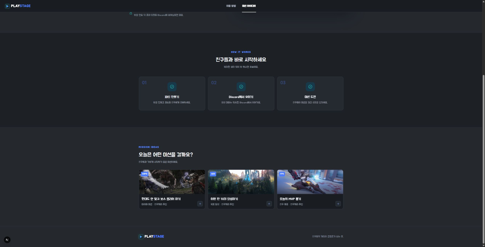

  
  <h1>PLAYSTAGE</h1>
  
<strong>같이 보고, 미션 걸고, 더 재밌게 플레이.</strong>

  

    친구의 게임 화면을 함께 보면서 미션을 제안하고, 
    성공과 실패를 Discord와 웹에서 같이 결정하는 친구 전용 게임 파티입니다.
  

  

    <a href="https://playstage-bay.vercel.app/">서비스 바로가기</a>
  

## 게임 방송보다, 친구들과 노는 방법

PLAYSTAGE는 불특정 다수를 위한 스트리밍 플랫폼이 아닙니다. 방 코드를 아는 친구들끼리 모여 한 명의 게임 화면을 보고, “이번 판 10킬”, “한 대도 맞지 않고 보스 클리어” 같은 미션을 걸며 노는 작은 파티 공간입니다.

- 별도 방송 프로그램 없이 브라우저에서 화면과 시스템 소리 공유
- 초대 링크 또는 20자리 방 코드로 비공개 파티 참여
- 실시간 채팅, 화면 클릭 핑, 이모지와 낙서 반응
- 미션 제안 및 성공·실패 투표
- Discord 슬래시 명령어, 버튼 투표, 포인트 연동
- 호스트가 떠나면 방을 종료하고 오래된 임시 방은 자동 정리

## 이렇게 사용합니다

1. 호스트가 웹 또는 Discord의 `/파티` 명령으로 방을 만듭니다.
2. 친구들이 있는 Discord 채널에 봇을 설치하고 `/연결`로 방 코드를 연결합니다.
3. 호스트가 게임 화면을 공유하고 친구에게 참가 링크를 보냅니다.
4. 친구들은 웹과 Discord에서 미션을 걸고 성공 여부를 투표합니다.

### Discord와 파티 연결

웹에서 먼저 만든 방도 Discord 채널에서 `/연결 방코드`를 실행하면 바로 연결됩니다. 연결 여부는 스튜디오에서 자동으로 확인하며, Discord 없이 먼저 방송하는 것도 가능합니다.

### 호스트 스튜디오

방 제목과 코드를 준비한 뒤 공유할 화면을 선택합니다. 방송 중에는 화면 전환, 일시정지, 시스템 소리, 전체화면, 낙서 초기화를 한곳에서 제어할 수 있습니다. 오른쪽 패널에서는 채팅, 진행 중인 미션과 참가자를 확인합니다.

### 친구들과 고르는 미션

처음부터 거창할 필요는 없습니다. 미션 아이디어를 골라 가볍게 시작하고, 파티에 들어온 친구들이 새로운 미션을 제안할 수 있습니다.

## Discord 명령어

| 명령어 | 설명 |
| --- | --- |
| `/파티 제목` | Discord에서 새 PLAYSTAGE 파티를 만듭니다. |
| `/연결 방코드` | 웹에서 만든 기존 방을 현재 채널과 연결합니다. |
| `/미션 내용 보상` | 현재 파티에 미션을 제안합니다. |
| `/포인트` | 내 PLAYSTAGE 포인트를 확인합니다. |
| `/선물 친구 포인트` | 친구에게 포인트를 보냅니다. |
| `/순위` | 서버 친구들의 포인트 순위를 확인합니다. |

미션 투표는 웹과 Discord를 합쳐 한 사람당 한 번만 반영됩니다. Discord에서 먼저 투표했다면 웹에서 다시 누를 수 없고, 반대의 경우도 같습니다.

## Discord 화면 공유와 무엇이 다른가요?

Discord가 친구들과 이야기하고 화면을 보여주는 공간이라면, PLAYSTAGE는 그 화면을 함께 가지고 노는 공간입니다.

친구가 미션을 제안하면 방송 화면에 바로 나타나고, 파티원들은 성공과 실패를 투표합니다. 

화면 위에 핑을 찍거나 이모지와 낙서를 남길 수도 있습니다. 단순히 게임을 구경하는 데서 끝나지 않고, 보고 있는 친구들도 플레이의 일부가 됩니다.

음성 대화는 익숙한 Discord에서 그대로 이어가면 됩니다.

## 이런 파티에 잘 어울려요

- 친구의 보스전을 보며 제한 시간 미션을 걸고 싶을 때
- 내전을 하면서 오늘의 MVP를 함께 뽑고 싶을 때
- 게임을 직접 하지는 않아도 구경하며 장난치고 싶을 때
- 방송 플랫폼에 공개하지 않고 아는 친구끼리만 놀고 싶을 때
- Discord 음성 채널에 작은 게임 이벤트를 더하고 싶을 때

## 우리가 만들고 싶은 경험

PLAYSTAGE에서 중요한 것은 시청자 수가 아닙니다. 

친구 한두 명이 들어와 미션 하나를 걸고, 화면에 핑을 찍고, 성공 여부로 티격태격하는 순간을 더 재미있게 만드는 것이 목표입니다.

게임을 잘하지 않아도 괜찮고 거창한 방송 장비도 필요하지 않습니다. 

방을 만들고 친구를 초대하면 바로 시작할 수 있는, 가볍고 사적인 게임 파티를 지향합니다.

---

  <strong>친구들의 게임이 콘텐츠가 되는 곳, PLAYSTAGE</strong>

